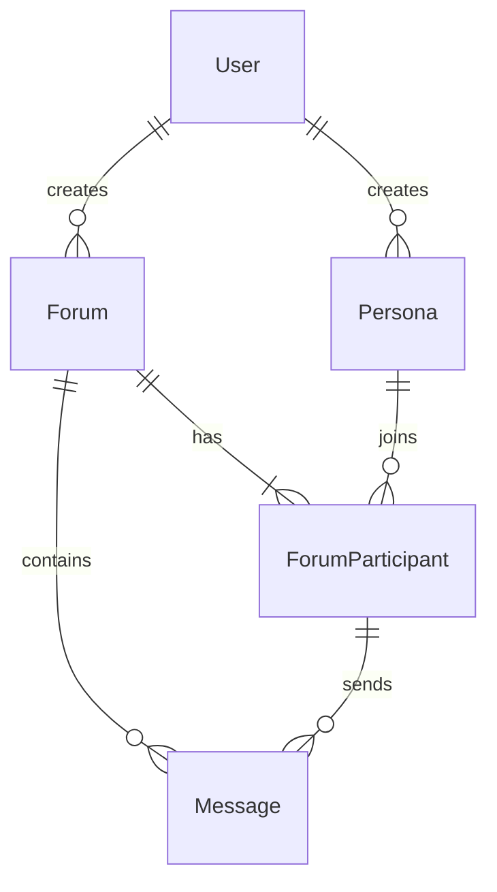

# MADF 项目架构文档

## 1. 项目整体架构

MADF (Multi-Agent Discussion Framework) 是一个基于多智能体协作的圆桌论坛系统。系统采用前后端分离架构，通过 RESTful API 进行通信，并利用 WebSocket 实现实时消息推送。

### 1.1 系统架构图

```mermaid
graph TD
    User[用户] -->|HTTP/WebSocket| Frontend[前端 (Vue 3 + Vite)]
    Frontend -->|REST API| Gateway[API 网关 (FastAPI)]
    
    subgraph "后端服务 (Backend)"
        Gateway --> Auth[认证模块]
        Gateway --> Forum[论坛管理模块]
        Gateway --> Agent[智能体核心模块]
        Gateway --> God[上帝模式模块]
        
        Agent -->|LLM 调用| ZhipuAI[智谱 AI 服务]
        God -->|LLM 调用| ZhipuAI
        
        Auth --> DB[(数据库 - SQLite/PostgreSQL)]
        Forum --> DB
        Agent --> DB
        God --> DB
    end
    
    subgraph "数据存储"
        DB
    end
```

### 1.2 模块依赖关系

- **Frontend**: 依赖 Backend API, WebSocket 服务。
- **Backend (App)**:
  - `app.api`: 依赖 `app.core`, `app.crud`, `app.models`, `app.schemas`。
  - `app.agent`: 依赖 `zhipuai` SDK, `app.core` (配置)。
  - `app.core`: 基础配置，不依赖业务模块。
  - `app.db`: 数据库连接，依赖 `app.core`。

## 2. 核心模块详细分析

### 2.1 智能体核心模块 (`app/agent`)

负责驱动论坛中的 AI 参与者进行思考和发言。

- **功能职责**: 
  - 角色扮演 (Role Playing)
  - 上下文记忆管理 (Memory Management)
  - 思考过程 (Chain of Thought)
  - 发言生成 (Response Generation)
- **输入接口**:
  - `think(context)`: 接收当前论坛上下文，输出思考结果（JSON）。
  - `speak(thought, context)`: 接收思考结果和上下文，输出发言内容（Stream）。
- **数据流转**:
  `API Request` -> `Agent.think()` -> `LLM API` -> `Thought Result` -> `Agent.speak()` -> `LLM API` -> `Stream Response` -> `Frontend`

### 2.2 论坛管理模块 (`app/api/v1/endpoints/forums.py`)

负责论坛的生命周期管理和消息流转。

- **功能职责**:
  - 创建论坛、邀请 Agent。
  - 记录消息历史。
  - 广播实时消息。
- **输入接口**:
  - `POST /forums/`: 创建论坛。
  - `POST /forums/{id}/messages`: 发送消息（用户或 Agent）。
- **数据流转**:
  `User/Agent Message` -> `API` -> `CRUD` -> `Database` -> `WebSocket Broadcast` -> `All Clients`

### 2.3 上帝模式模块 (`app/agent/god.py` & `app/api/v1/endpoints/god.py`)

负责根据简短描述自动生成完整的角色设定。

- **功能职责**:
  - 角色生成 (Persona Generation)。
  - 自动补全设定 (Auto-completion of bio, theories, style)。
- **输入接口**:
  - `generate_personas(theme, n)`: 根据主题生成 n 个角色。
- **数据流转**:
  `Theme String` -> `God Agent` -> `LLM API` -> `List[Persona]` -> `Database`

### 2.4 认证与用户模块 (`app/core/security.py`, `app/api/v1/endpoints/auth.py`)

- **功能职责**: JWT 签发、用户鉴权、密码哈希。
- **输入接口**: `login`, `register`。
- **数据流转**: `Credentials` -> `Hash Check` -> `JWT Token`。

## 3. 数据库设计 (`app/models`)

采用 SQLAlchemy ORM，核心实体关系如下：

- **User**: 系统用户。
- **Persona**: AI 角色定义（包含 prompt, bio）。
- **Forum**: 讨论组实例。
- **ForumParticipant**: 关联表，记录 Persona 在 Forum 中的状态。
- **Message**: 论坛消息记录。


