# 项目结构分析报告

**生成时间**: 2026-02-27 23:18:13
**项目根目录**: F:\文档\code\MADF-Multi-Agent-Discussion-Dramework

## 1. 项目概览
- **总文件数**: 124
- **总大小**: 1.03 MB
- **文件类型分布**:
  - **Other**: 7
  - **Source Code**: 97
  - **Config**: 7
  - **Documentation**: 8
  - **Frontend Asset**: 3
  - **Resource**: 2

## 2. 目录结构与职责
```
.
├── .gitignore (2.3KB)
├── Dockerfile (0.7KB)
├── README.md (1.8KB)
├── alembic/ (Contains 7 tracked files, 17.3KB)
├── alembic.ini (3.1KB)
├── analyze_project.py (18.1KB)
├── app/ (Contains 44 tracked files, 133.2KB)
├── check_env.py (0.2KB)
├── config.example.py (0.1KB)
├── config.py (0.2KB)
├── docs/ (Contains 4 tracked files, 11.3KB)
├── fix_db_constraint.py (2.3KB)
├── fix_db_messages.py (0.8KB)
├── fix_db_moderators.py (2.1KB)
├── frontend/ (Contains 47 tracked files, 369.0KB)
├── madf.db (348.0KB)
├── project_manifest.json (43.9KB)
├── project_structure_report.md (4.2KB)
├── requirements.txt (0.1KB)
├── scripts/ (Contains 1 tracked files, 8.1KB)
├── test.db (64.0KB)
├── test_client/ (Contains 1 tracked files, 8.5KB)
├── tests/ (Contains 1 tracked files, 3.1KB)
├── utils.py (7.3KB)
├── verify_god.py (2.4KB)
└── verify_sync.py (4.4KB)
```
> 注：此树状图仅统计分析范围内文件（已排除 node_modules 等）。完整列表见 `project_manifest.json`。

## 3. 模块职责说明
| 模块路径 | 职责/描述 |
| --- | --- |
| `.` | MADF - Multi-Agent Discussion Framework |
| `frontend` | Vue 3 + TypeScript + Vite |

## 4. 依赖关系图 (Mermaid)

```mermaid
graph TD
    env.py --> logging
    env.py --> sqlalchemy
    env.py --> sqlalchemy
    069626729e0d_sync_agent_core.py --> alembic
    069626729e0d_sync_agent_core.py --> sqlalchemy
    71cfcbfae558_initial.py --> alembic
    71cfcbfae558_initial.py --> sqlalchemy
    7875f9bdc74e_add_email_to_user.py --> alembic
    7875f9bdc74e_add_email_to_user.py --> sqlalchemy
    807d93f0bc89_add_duration.py --> alembic
    807d93f0bc89_add_duration.py --> sqlalchemy
    agent.py --> utils
    agent.py --> app
    god.py --> utils
    deps.py --> fastapi
    deps.py --> fastapi
    api.py --> fastapi
    api.py --> app
    agents.py --> fastapi
    agents.py --> sqlalchemy
    auth.py --> fastapi
    auth.py --> fastapi
    auth.py --> sqlalchemy
    forums.py --> fastapi
    forums.py --> sqlalchemy
    god.py --> fastapi
    god.py --> sqlalchemy
    moderators.py --> fastapi
    moderators.py --> sqlalchemy
    personas.py --> fastapi
    personas.py --> sqlalchemy
    users.py --> fastapi
    users.py --> sqlalchemy
    users.py --> app
    base.py --> pydantic
    security.py --> jose
    websockets.py --> fastapi
    crud_moderator.py --> sqlalchemy
    crud_moderator.py --> app
    crud_system_log.py --> sqlalchemy
    crud_system_log.py --> app
    crud_system_log.py --> app
    __init__.py --> sqlalchemy
    __init__.py --> app
    __init__.py --> app
    session.py --> sqlalchemy
    session.py --> sqlalchemy
    session.py --> sqlalchemy
    main.py --> fastapi
    main.py --> fastapi
    main.py --> fastapi
```


## 5. 核心文件规范头注释模板
以下为建议的 Python 文件头注释模板：
```python
"""
文件名: <filename>
作者: <author>
创建日期: <date>
功能概述: 
    [在此处描述该模块的主要功能]

输入输出:
    - 输入: [参数说明]
    - 输出: [返回值说明]

关键函数:
    - [函数名]: [功能简述]
"""
```

## 6. 问题检测报告
### ⚠️ 缺失的项目文件
- [ ] `LICENSE`
- [ ] `CHANGELOG.md`
### ⚠️ 空文件夹
- `frontend\app\core\responses`
### ⚠️ 硬编码路径检测 (Top 10)
- `app/api/v1/api.py:6`
- `app/tests/test_api.py:14`
- `app/tests/test_api.py:23`
- `app/tests/test_api_errors.py:34`
- `app/tests/test_forum_creation.py:7`
- `app/tests/test_moderator_api.py:8`
- `frontend/package-lock.json:5517`
- `frontend/package-lock.json:5519`
- `frontend/src/router/index.ts:5`
- `frontend/src/stores/auth.ts:38`
